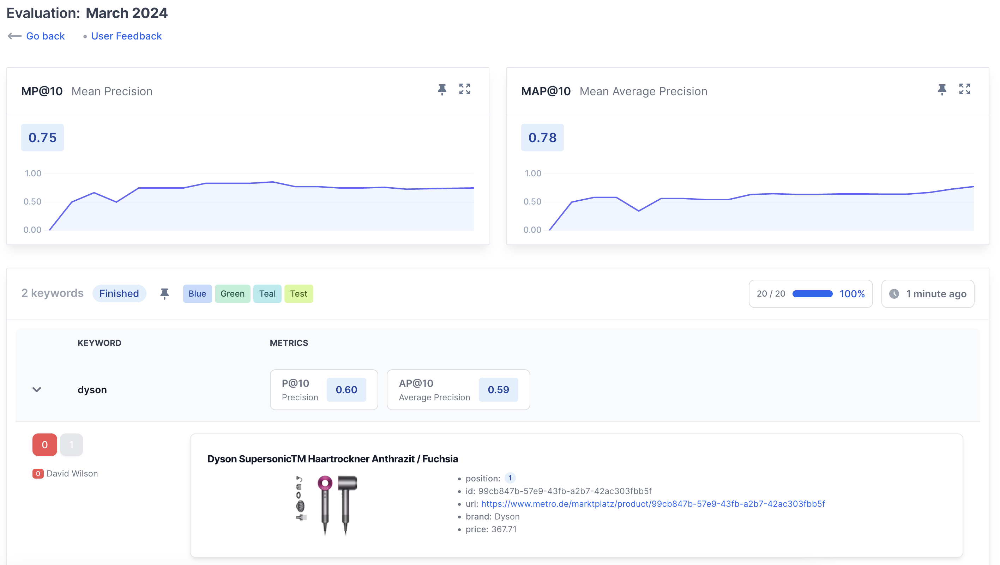
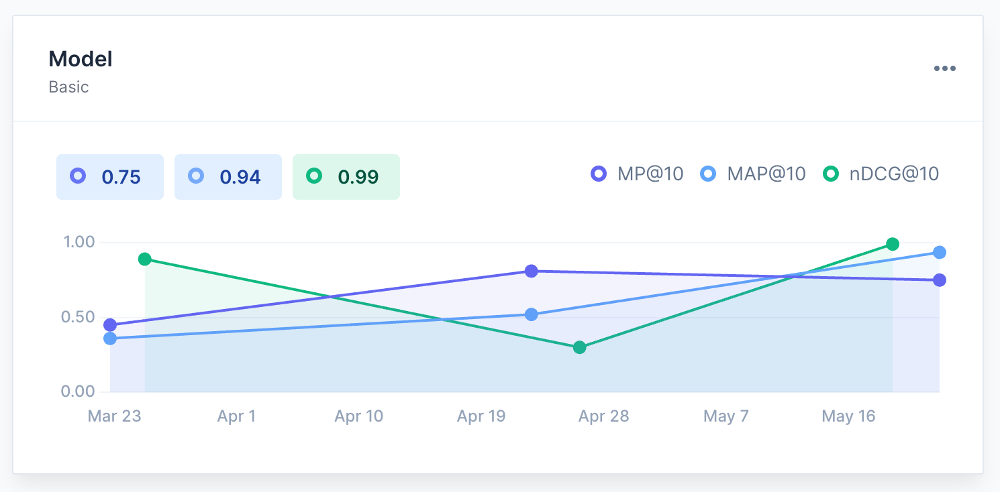
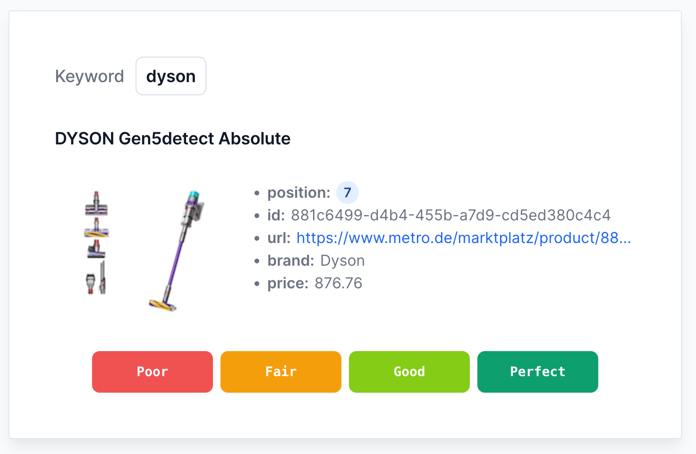
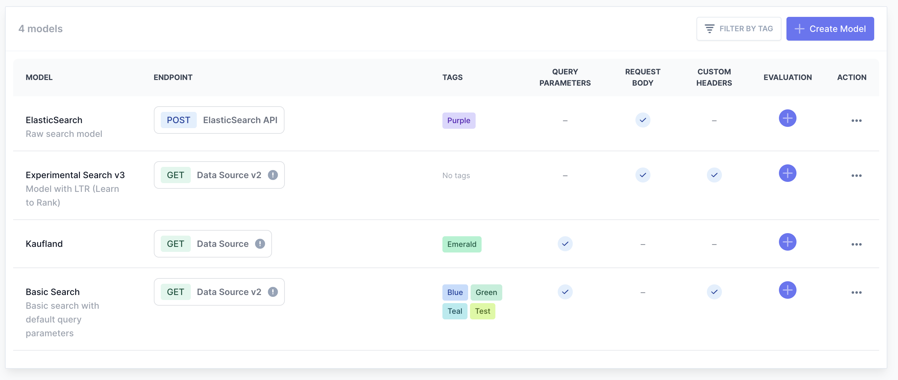

# SearchTweak

[](https://php.net)
[](https://laravel.com)
[](LICENSE.md)

**Self-hosted search relevance evaluation platform.** Assess search quality by running keyword queries against your search APIs, collecting human relevance judgments, and calculating industry-standard IR metrics.

Use it to benchmark search configurations, label training data for ML models, and track search quality over time.



## Key Features

- **Search Evaluation** — run keyword queries against any search API, collect human relevance judgments, and compute metrics automatically
- **IR Metrics** — Precision, MAP, MRR, CG, DCG, nDCG with support for Binary, Graded, and Detail grading scales
- **Metrics Over Time** — track how search quality changes across evaluations with historical charts
- **Feedback Management** — assign grading tasks to team members, reuse judgments across evaluations, scoring guidelines
- **Team Collaboration** — role-based access (Admin, Evaluator), team invitations, tag-based organization
- **Real-time Updates** — live progress via WebSockets as evaluations run and grades come in
- **REST API** — manage evaluations and models programmatically with token-based authentication
- **Customizable Dashboard** — configurable widgets for metrics, leaderboard, and feedback activity

<details>
<summary>More screenshots</summary>

### Metrics Dashboard


### Give Feedback


### Search Models


</details>

## Tech Stack

| Layer | Technology |
|-------|-----------|
| Backend | Laravel 11 (PHP 8.3) |
| Frontend | Livewire 3, Alpine.js, Tailwind CSS |
| Real-time | Laravel Reverb (WebSockets) |
| Queue | Laravel Horizon |
| Database | MySQL |
| Cache/Queue/Sessions | Redis |
| Infrastructure | Docker Compose, Traefik, Nginx, PHP-FPM |
| Auth | Jetstream + Sanctum + Fortify |

## Requirements

- [Docker](https://docs.docker.com/get-docker/) and Docker Compose
- [Make](https://www.gnu.org/software/make/) (pre-installed on macOS/Linux)

## Getting Started

### 1. Clone the Repository

```bash
git clone https://github.com/afedukov/searchtweak.git
cd searchtweak/devops
```

### 2. Setup Environment

```bash
cp .env.dist .env
```

### 3. Configure Hosts File

Edit your `/etc/hosts` file (or `C:\Windows\System32\drivers\etc\hosts` on Windows):
```
127.0.0.1    searchtweak.local traefik.searchtweak.local db.searchtweak.local
```

### 4. Start the Application

```bash
make
```

This will start all containers and bootstrap the application (migrations, cache, assets).

### 5. Open in Browser

| Service | URL |
|---------|-----|
| App | http://searchtweak.local |
| Traefik Dashboard | http://traefik.searchtweak.local |
| phpMyAdmin | http://db.searchtweak.local |
| MailHog | http://localhost:8025 |

### Default Admin User

Log in at http://searchtweak.local with:

- **Email:** `admin@searchtweak.com`
- **Password:** `12345678`

## Useful Commands

```bash
cd devops
make start        # Start the application
make stop         # Stop the application
make bootstrap    # Bootstrap the application
make vite         # Start Vite development server
make vite-prod    # Build Vite for production
```

## Running Tests

```bash
cd devops
make test                                                   # Run all tests
docker compose run --rm artisan test                        # Run all tests (alternative)
docker compose run --rm artisan test --testsuite=Unit       # Run unit tests only
docker compose run --rm artisan test --testsuite=Feature    # Run feature tests only
docker compose run --rm artisan test --filter TestName      # Run a specific test
```

## Email Setup

By default, **SearchTweak** uses [MailHog](https://github.com/mailhog/MailHog) to capture outgoing emails in development. Access the MailHog UI at http://localhost:8025.

<details>
<summary>Configuring real email sending (SMTP / Amazon SES)</summary>

Remove the `mailhog` service from `/devops/docker-compose.yml`, then update your `.env` file:

#### SMTP
```dotenv
MAIL_MAILER=smtp
MAIL_HOST=smtp.your-email-provider.com
MAIL_PORT=587
MAIL_USERNAME=your-email@example.com
MAIL_PASSWORD=your-email-password
MAIL_ENCRYPTION=tls
MAIL_FROM_ADDRESS=your-email@example.com
MAIL_FROM_NAME="${APP_NAME}"
```

#### Amazon SES
```dotenv
MAIL_MAILER=ses
AWS_ACCESS_KEY_ID=your-aws-access-key
AWS_SECRET_ACCESS_KEY=your-aws-secret-key
AWS_SES_REGION=us-east-1
MAIL_FROM_ADDRESS=your-email@example.com
MAIL_FROM_NAME="${APP_NAME}"
```

</details>

<details>
<summary>Enforcing email verification</summary>

### 1. Update the User Model
In `App\Models\User`, implement the `MustVerifyEmail` interface:
```php
class User extends Authenticatable implements TaggableInterface, MustVerifyEmail
{
    // ...
}
```

### 2. Enable Email Verification in Fortify
In `config/fortify.php`, uncomment:
```php
'features' => [
    // ...
    Features::emailVerification(),
    // ...
],
```

</details>

## Documentation

Full documentation is available at [DOCUMENTATION.md](DOCUMENTATION.md).

## Contributing

Contributions are welcome! Please fork the repository and submit a pull request with your enhancements or bug fixes.

## License

This project is licensed under the **Functional Source License, Version 1.1** (FSL-1.1-Apache-2.0), with an irrevocable grant to the Apache License, Version 2.0 effective on the second anniversary of the software's release.

Copyright 2024-2026 Andrey Fedyukov

- You may use, modify, and redistribute the software for any purpose, except in products or services that compete with the software or any other product or service we offer.
- After two years, you may alternatively use the software under the Apache License, Version 2.0.

See the full [LICENSE](LICENSE.md) file for details.
